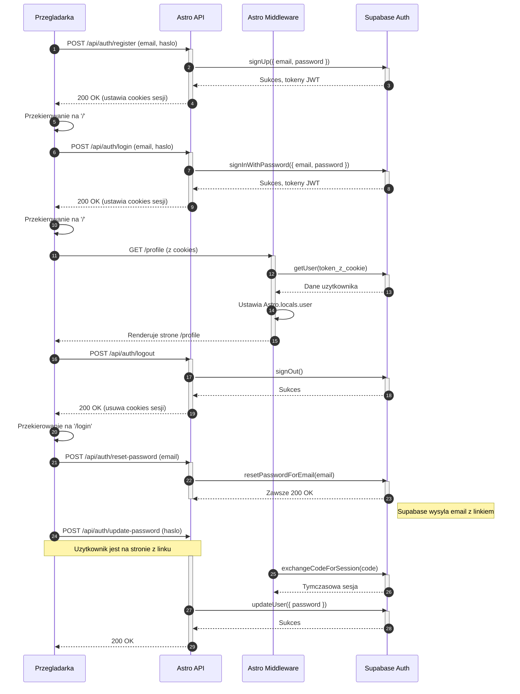

<authentication_analysis>

1.  **Przepływy autentykacji**:
    - **Rejestracja**: Nowy użytkownik zakłada konto przy użyciu e-maila i hasła.
    - **Logowanie**: Zarejestrowany użytkownik loguje się, ustanawiając sesję.
    - **Wylogowanie**: Aktywna sesja użytkownika jest unieważniana.
    - **Resetowanie hasła**: Użytkownik, który zapomniał hasła, może je zresetować poprzez e-mail.
    - **Dostęp do chronionych zasobów**: Zalogowany użytkownik próbuje uzyskać dostęp do strony lub danych, co wymaga weryfikacji sesji.
    - **Automatyczne odświeżanie tokenu**: Biblioteka Supabase w tle odświeża token dostępowy, aby utrzymać sesję bez konieczności ponownego logowania.

2.  **Główni aktorzy i ich interakcje**:
    - **Przeglądarka (Użytkownik)**: Inicjuje wszystkie akcje (wypełnia formularze, klika linki, nawiguje po aplikacji). Przechowuje tokeny sesji w bezpiecznych ciasteczkach (`httpOnly`).
    - **Astro (Frontend/Backend)**: Renderuje strony (`.astro`), komponenty UI (`.tsx`) i obsługuje logikę biznesową w endpointach API (`/api/auth/*`).
    - **Middleware (Astro)**: Centralny punkt weryfikacji. Przechwytuje każde żądanie, odczytuje token z ciasteczka i dołącza kontekst użytkownika (`Astro.locals.user`) do dalszego przetwarzania. Odpowiada za ochronę tras.
    - **Supabase Auth**: Zewnętrzna usługa, która zarządza użytkownikami, wystawia i weryfikuje tokeny JWT oraz obsługuje wysyłkę e-maili (np. w celu resetu hasła).

3.  **Procesy weryfikacji i odświeżania tokenów**:
    - **Weryfikacja**: Przy każdym żądaniu do chronionego zasobu, `Middleware` używa tokenu z ciasteczka i wysyła go do `Supabase Auth` w celu weryfikacji (`supabase.auth.getUser()`).
    - **Odświeżanie**: Biblioteka kliencka Supabase automatycznie używa tokenu odświeżania (Refresh Token), aby uzyskać nowy token dostępowy (Access Token) z `Supabase Auth`, gdy stary wygaśnie. Dzieje się to transparentnie dla użytkownika.

4.  **Opis kroków autentykacji (na przykładzie logowania)**: 1. Użytkownik wypełnia formularz logowania w Przeglądarce. 2. Przeglądarka wysyła żądanie `POST` do endpointu `/api/auth/login` w Astro API. 3. Astro API wywołuje `supabase.auth.signInWithPassword()` z danymi użytkownika. 4. Supabase Auth weryfikuje dane. Jeśli są poprawne, generuje tokeny JWT. 5. Supabase Auth zwraca tokeny do Astro API. 6. Astro API ustawia tokeny w bezpiecznych ciasteczkach i odsyła odpowiedź `200 OK` do Przeglądarki. 7. Przeglądarka przekierowuje użytkownika na stronę główną. Przy kolejnych żądaniach ciasteczko z sesją jest automatycznie dołączane.
    </authentication_analysis>

<mermaid_diagram>

</mermaid_diagram>
