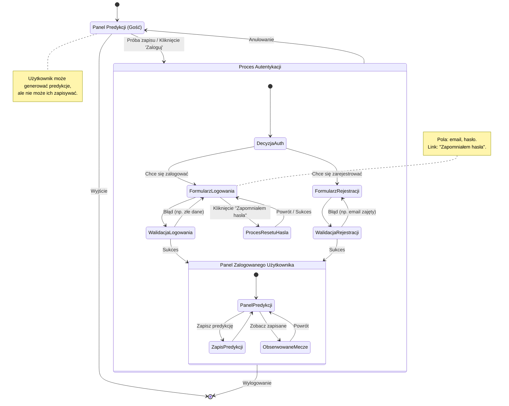

<user_journey_analysis>
1.  **Ścieżki użytkownika**:
    *   **Nowy użytkownik**: Rejestracja → Korzystanie z aplikacji.
    *   **Powracający użytkownik**: Logowanie → Korzystanie z aplikacji.
    *   **Użytkownik, który zapomniał hasła**: Reset hasła → Logowanie → Korzystanie z aplikacji.
    *   **Niezalogowany użytkownik (Gość)**: Przeglądanie publicznych treści (Panel Predykcji) bez możliwości zapisu.

2.  **Główne podróże i stany**:
    *   **Gość**: `Przeglądanie Panelu Predykcji` → `Próba zapisu` → `Przekierowanie do logowania`.
    *   **Autentykacja**: Stan złożony obejmujący `Logowanie`, `Rejestrację` i `Reset Hasła`.
    *   **Zalogowany użytkownik**: `Panel Predykcji (z możliwością zapisu)` → `Zapis predykcji` → `Przeglądanie Obserwowanych Meczów`.

3.  **Punkty decyzyjne i alternatywne ścieżki**:
    *   Na stronie głównej użytkownik decyduje, czy chce się zalogować, zarejestrować, czy korzystać jako gość.
    *   Podczas logowania może wybrać ścieżkę "Zapomniałem hasła".
    *   Podczas rejestracji może wystąpić błąd (np. zajęty e-mail), co cofa go do formularza z komunikatem.
    *   Po pomyślnej autentykacji (logowanie/rejestracja) jest przekierowywany do panelu głównego.

4.  **Opis celu każdego stanu**:
    *   **`[*]` (Początek/Koniec)**: Wejście i wyjście z aplikacji.
    *   **`Panel Predykcji (Gość)`**: Stan, w którym niezalogowany użytkownik może generować predykcje, ale nie może ich zapisywać.
    *   **`Proces Autentykacji`**: Stan złożony, grupujący wszystkie akcje związane z zarządzaniem kontem użytkownika.
    *   **`Formularz Logowania`**: Miejsce, gdzie użytkownik podaje swoje dane uwierzytelniające.
    *   **`Formularz Rejestracji`**: Miejsce tworzenia nowego konta.
    *   **`Proces Resetu Hasła`**: Sekwencja kroków umożliwiająca odzyskanie dostępu do konta.
    *   **`Panel Zalogowanego Użytkownika`**: Główny stan aplikacji dla zalogowanego użytkownika, z pełną funkcjonalnością (zapis, edycja, usuwanie predykcji).
    *   **`Obserwowane Mecze`**: Dedykowany widok z listą zapisanych predykcji.
</user_journey_analysis>

<mermaid_diagram>

</mermaid_diagram>
