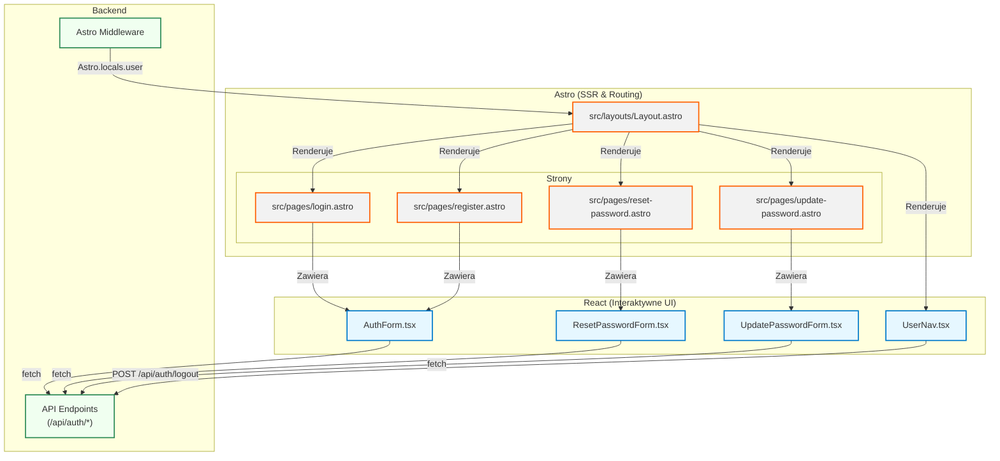

<architecture_analysis>

1.  **Wszystkie komponenty**:
    - **Strony Astro**: `login.astro`, `register.astro`, `reset-password.astro`, `update-password.astro`.
    - **Layout Astro**: `Layout.astro` (główny layout aplikacji).
    - **Komponenty React**: `AuthForm.tsx` (uniwersalny formularz), `UserNav.tsx` (nawigacja użytkownika), komponenty dla resetowania i aktualizacji hasła.

2.  **Główne strony i ich komponenty**:
    - **`src/layouts/Layout.astro`**: Zawiera komponent `UserNav.tsx`, który jest renderowany na każdej stronie.
    - **`src/pages/login.astro`**: Zawiera `<AuthForm mode='login' client:load />`.
    - **`src/pages/register.astro`**: Zawiera `<AuthForm mode='register' client:load />`.
    - **`src/pages/reset-password.astro`**: Będzie zawierać dedykowany komponent React do wysłania prośby o reset.
    - **`src/pages/update-password.astro`**: Będzie zawierać dedykowany komponent React do ustawienia nowego hasła.

3.  **Przepływ danych**:
    - `Layout.astro` odczytuje stan zalogowania z `Astro.locals.user` (dostarczone przez middleware) i przekazuje go jako _prop_ do `UserNav.tsx`.
    - `AuthForm.tsx` zarządza swoim wewnętrznym stanem (dane formularza, błędy, stan ładowania).
    - Po wysłaniu formularza, `AuthForm.tsx` komunikuje się z API Astro (`/api/auth/*`).
    - Po pomyślnej operacji, `AuthForm.tsx` wykonuje przekierowanie po stronie klienta (`window.location.href`).

4.  **Opis funkcjonalności każdego komponentu**:
    _ **`Layout.astro`**: Główna struktura HTML strony, zawiera nagłówek, stopkę i slot na treść. Odpowiada za przekazanie stanu sesji do komponentów UI.
    _ **`UserNav.tsx`**: Komponent wyświetlany w nagłówku. Warunkowo renderuje linki "Zaloguj się"/"Zarejestruj się" lub informacje o użytkowniku i przycisk "Wyloguj się".
    _ **`AuthForm.tsx`**: Uniwersalny, interaktywny formularz React do logowania i rejestracji. Obsługuje walidację po stronie klienta (`zod`, `react-hook-form`), komunikację z API i wyświetlanie błędów.
    _ **`ResetPasswordForm.tsx` (planowany)**: Prosty formularz z jednym polem na e-mail do zainicjowania procesu resetowania hasła. \* **`UpdatePasswordForm.tsx` (planowany)**: Formularz z polem na nowe hasło, używany na stronie, na którą trafia użytkownik po kliknięciu linku z e-maila.
    </architecture_analysis>

<mermaid_diagram>

</mermaid_diagram>
